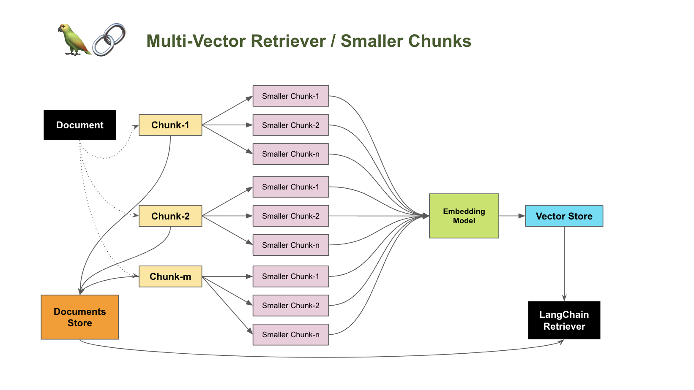
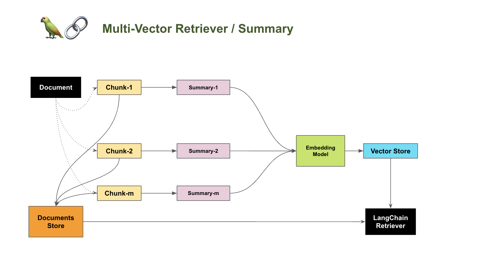
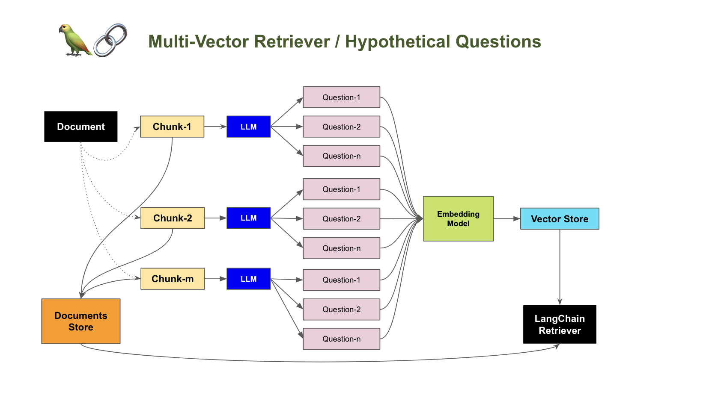

# 04 MultiVector Retriever

To improve the retrieval effectiveness, in practice we can store multiple vectors per document. It's been proved in multiple use cases.

LangChain provides a retriever component `MultiVectorRetriever` which support such mechanism. It can be implemented in the following methods:

- Smaller Chunks
  
  Split a document into smaller chunks, and embed them.

- Summary

  Create a summary for each document, embed that along with (or instead of) the document.

- Hypothetical questions

  Create hypothetical questions that each document would be appropriate to answer, embed those along with (or instead of) the document.

## Methods in Brief

### Smaller Chunks

### Summary

### Hypothetical questions

## Examples

[Python Notebook](./04_MultiVector_Retriever.ipynb)